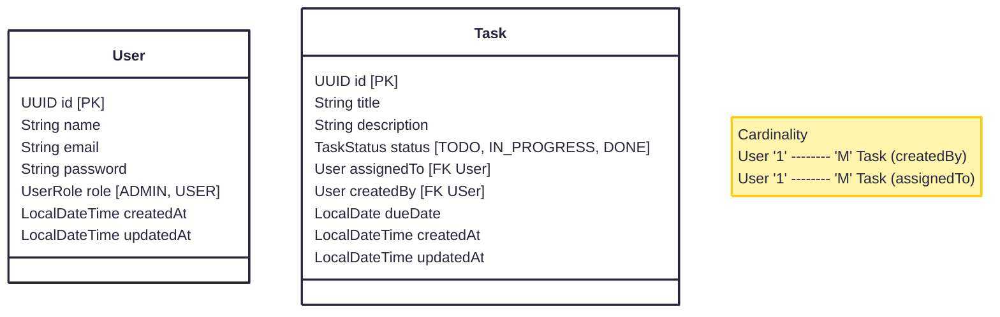

# TaskHub

> Phase 1: Core Setup — Auth + Task Service (monolith style first)

- __Auth Service__
    - User Registration
    - Login
    - JWT Tokens
    - Password Encryption (Bcrypt)
- __Task Service__
    - Task CRUD
- PostgreSQL for DB storage
    - JPA relationships
- Spring profiles
    - dev/test/prod
- Testing
    - junit (unit test)
    - integration test

## Overview

- Trello like system for task management
- REST service
- PostgreSQL storage

## Funtional Requirements

1. Users and Register themselves
2. Users can Login and recieve JWT token
3. Users can Create, Read, Update, and Delete own Tasks
4. Users can assign tasks to another User (Collaboration)
5. Users can see the tasks assigned to them
6. Pagination and filtering on task list

## Non Funtional Requirements

1. __Security__: Password Encryption, JWT auth
2. __Scalability__: Stateless REST APIs, DB persistence
    - Each request is self sufficient
    - No session memory in the server (JWT token in each request)
    - All the data is in the backend DB
    - Can have multiple horizontally scaled server serving requests
    - Any instance can handle any request → horizontal scaling
3. __Reliability__: Tranasactional writes (Spring Data JPA)
4. __Maintainability__: Modular package structure, DTO layer
    - Organize code by domain (auth, task, etc.)
    - Use MapStruct for automatic mapping between Entity ↔ DTO
5. __Performance__: Pagination, Indexes
6. __Testability__: Unit tests, integration test
7. __Observability__: Logging, Actuator endpoints
    - Actuator tells you how healthy the system is
    - Actuator Endpoints exposes system health and metrics

## Entity/Models



## API Endpoints (Draft)

### Auth Controller

> __POST__ `/api/auth/register` [No-Auth]

`Request Body`
```json
{
  "name": "string",
  "email": "string",
  "password": "string",
  "role": "ENUM"
}
```
`Response Body`
```json
{
  "userId": "UUID",
  "role": "ENUM"
}
```

> __POST__ `/api/auth/login` [No-Auth]

`Request Body`
```json
{
  "email": "string",
  "password": "string"
}
```
`Response Body`
```json
{
  "userId": "UUID",
  "role": "ENUM",
  "jwt": "string"
}
```

> __GET__ `/api/auth/me` [JWT Auth]

`Response Body`
```json
{
  "userId": "UUID",
  "role": "ENUM",
  "name": "string",
  "email": "string"
}
```

### Task Controller

> __GET__ `/api/tasks/{taskId}` [JWT Auth]

`Response Body`
```json
{
  "taskId": "UUID",
  "title": "string",
  "description": "string",
  "dueDate": "Date",
  "status": "ENUM",
  "createdBy": "UUID",
  "assignedTo": "UUID"
}
```

> __GET__ `/api/tasks` [JWT Auth] [Get all tasks created by and assigned to this User]

`Response Body`
```json
[
  {
    "taskId": "UUID",
    "title": "string",
    "description": "string",
    "dueDate": "Date",
    "status": "ENUM",
    "createdBy": "UUID",
    "assignedTo": "UUID"
  }
]
```

> __POST__ `/api/tasks` [JWT Auth]

`Request Body`
```json
{
  "title": "string",
  "description": "string",
  "dueDate": "Date"
}
```
`Response Body`
```json
{
  "taskId": "UUID",
  "title": "string",
  "description": "string",
  "dueDate": "Date",
  "status": "ENUM",
  "createdBy": "UUID",
  "assignedTo": "UUID"
}
```

> __PUT__ `/api/tasks/{taskId}` [JWT Auth]

`Request Body`
```json
{
  "title": "string",
  "description": "string",
  "dueDate": "Date",
  "status": "ENUM",
  "assignedTo": "UUID"
}
```
`Response Body`
```json
{
  "taskId": "UUID",
  "title": "string",
  "description": "string",
  "dueDate": "Date",
  "status": "ENUM",
  "createdBy": "UUID",
  "assignedTo": "UUID"
}
```

> __DELETE__ `/api/tasks/{taskId}` [JWT Auth]


`Response Body`
```json
{
  "taskId": "UUID",
  "title": "string",
  "description": "string",
  "dueDate": "Date",
  "status": "ENUM",
  "createdBy": "UUID",
  "assignedTo": "UUID"
}
```
