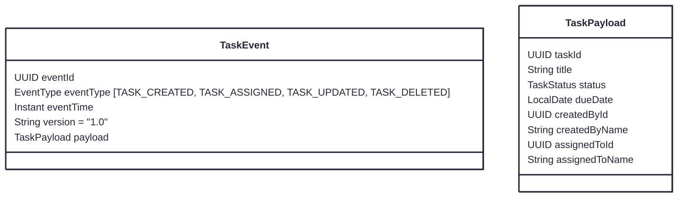
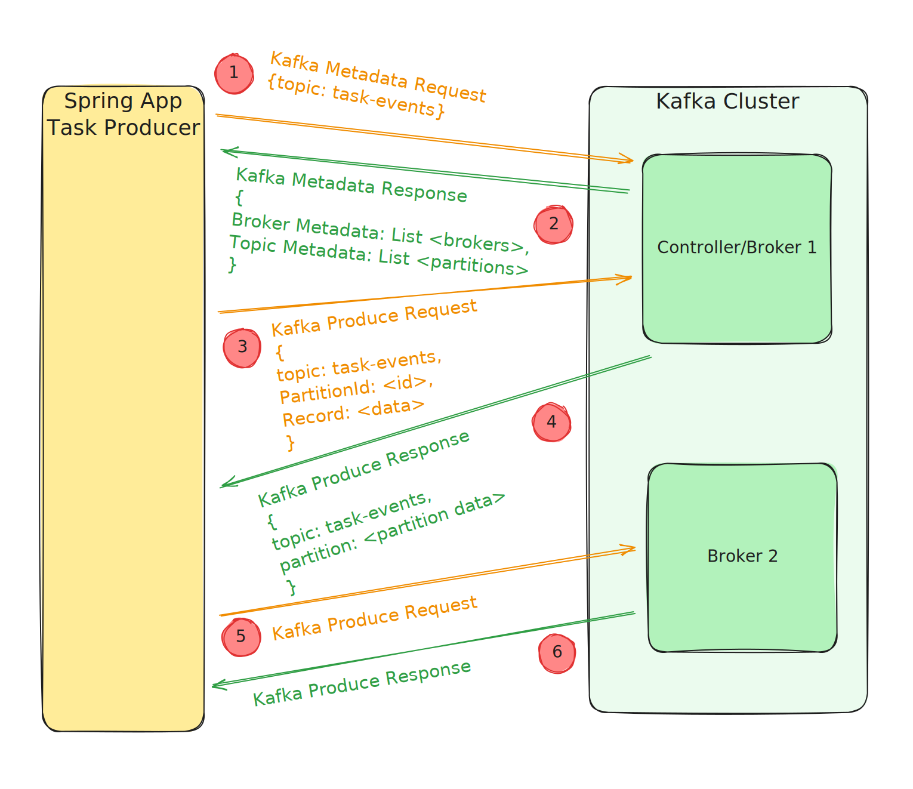

# TaskHub

> Phase 2: Asynchronous Communication (Kafka + Notification Service)

## Setup Kafka and Redis on docker

- create the docker-compose.yml (right next to pom.xml)
- this docker-compose will have the Kafka and redis
- Note: we are not using zookeeper, instead we are using KRaft (kafka inbuilt)

## Kafka Integration in Task Service

- Add Kafka dependencies to task-service
    - Modify the pom.xml with spring-kafka

- Create TaskEvent model
    - A lightweight DTO that carries event data like taskId, title, assignedUserId, eventType.

- Configure Kafka producer (application.yml + producer config class)
    - Define bootstrap servers, serializers, etc.

- Hook producer in service layer
    - When a task is created or assigned, produce an event to topic task-events.

## TaskEvent model

- This is the event that will be fired once the task is created/updated/deleted/assigned

## Configure Kafka producer (application.yml + producer config class)

- Setup topics in application.yml
    - task-events — main topic for all task domain events
    - task-events.DLT — dead-letter topic for failed events
- Setup key value serializer

## Kafka Producer Flow

## Principles for Event Publishing:

- Keep producer synchronous for DB save, but fire-and-forget publish after commit (or better: publish in tansactionally-aware way).
- Consumers are idempotent: store processed event IDs (Redis set or DB) to avoid duplicate notifications.
- Use retry and DLQ for consumer transient failures.
- Use structured event schema (JSON) with an eventId and occurredAt.
- Transactional considerations
    - Publishing after save() is usually fine, but if you need strict DB-transactional atomicity (produce only if DB commit succeeds), use KafkaTransactionManager or Spring Kafka’s outbox pattern.
